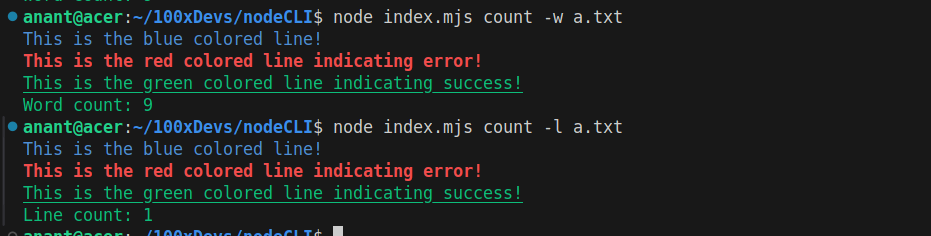
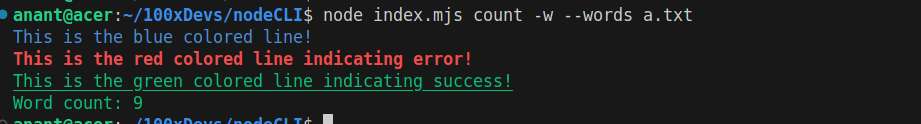

# CLI written in Node.js

### 1. Read the file and fetch line count.

```bash
node `index.mjs` count -l  a.txt
```


### 2. Read the file and fetch word count 

```bash
node `index.mjs` count -w  a.txt

```
